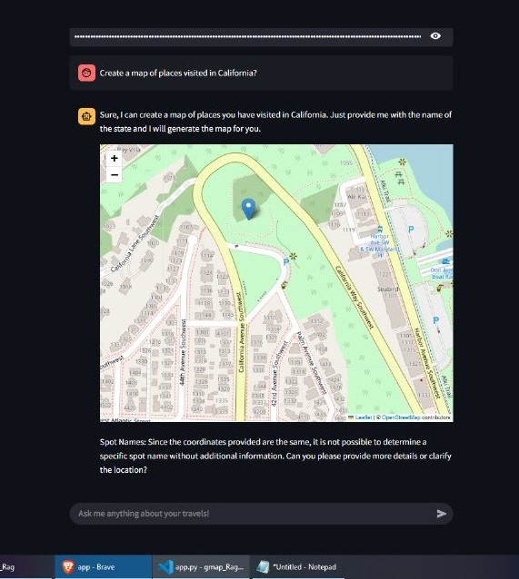

# RoamReader
An Interactive chatbot for user location History

#Instructions to use:
1)Download your google location history data from google takeout
2)Unzip the folder and locate the Semantic Location History and enter the path of the folder

